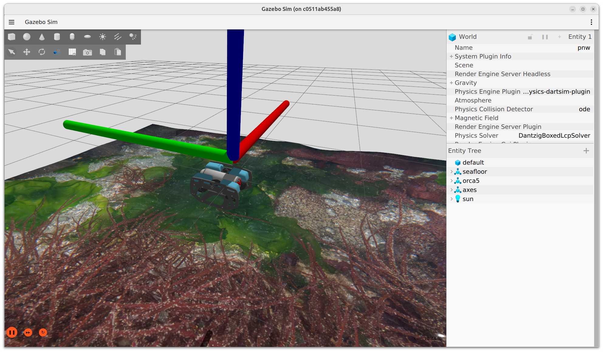
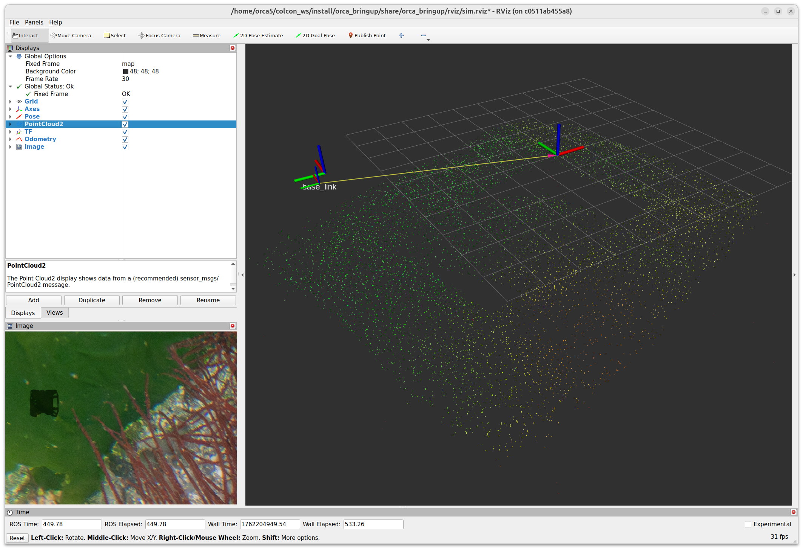

# Orca5

Orca5 uses [ORB_SLAM3](https://github.com/UZ-SLAMLab/ORB_SLAM3) and a single down-facing underwater camera to provide
visual odometry to a [BlueRobotics BlueROV2](https://www.bluerobotics.com) running
[ArduSub](https://ardupilot.org/sub).

## Requirements

* [ROS2 Jazzy](https://docs.ros.org/en/jazzy/Installation.html)
* [Gazebo Harmonic](https://gazebosim.org/docs/harmonic/install)
* [ArduSub](https://ardupilot.org/sub)
* [ardupilot_gazebo](https://github.com/ArduPilot/ardupilot_gazebo/tree/ros2)
* [orb_slam3_ros](https://github.com/clydemcqueen/orb_slam3_ros); this includes ORB_SLAM3

See the [Dockerfile](docker/Dockerfile) for details.

## Build and Run

Build a docker image, then run it:
~~~
cd docker
./build.sh sim
./run.sh sim nvidia
~~~

This is a dev container, so the orca5 directory will be mounted inside the container.
Finish the build process:
~~~
colcon build
source install/local_setup.bash
~~~

Launch the simulation:
~~~
source venv/bin/activate
ros2 launch orca_bringup sim.launch.py
~~~

This will launch Gazebo, RViz and all the ROS2 nodes.
The default simulation has the ROV sitting close to the seafloor.
ORB_SLAM3 should initialize and start tracking the seafloor.

Open a second terminal into the container:
~~~
docker exec -it orca5_sim /bin/bash
~~~

Launch mavproxy as the GCS:
~~~
source venv/bin/activate
mavproxy.py --out 127.0.0.1:14550 --out 127.0.0.1:14551 --master tcp:127.0.0.1:5760
~~~

ArduSub will initialize and start sending MAVLink messages to the SLAM bridge node.
In response, the bridge node will start sending visual odometry messages to ArduSub.
Wait for these messages from mavproxy:
~~~
AP: EKF3 IMU1 is using external nav data
AP: EKF3 IMU0 is using external nav data
~~~

Mavproxy is interactive, so we can execute commands. Arm the motors:
~~~
MANUAL> arm throttle
Got COMMAND_ACK: COMPONENT_ARM_DISARM: ACCEPTED
AP: Arming motors
AP: EKF3 IMU0 origin set
AP: EKF3 IMU1 origin set
AP: Using backup location
ARMED
Arming checks disabled
~~~

Load a mission:
~~~
MANUAL> wp load src/orca5/orca_bringup/missions/box_mission.txt
Loaded 6 waypoints from src/orca5/orca_bringup/missions/box_mission.txt
Loaded 6 waypoints in 0.01s
Sent all 6 waypoints
Got MISSION_ACK: TYPE_MISSION: ACCEPTED
AP: Flight plan received
~~~

Go to AUTO mode to run the mission:
~~~
MANUAL> mode auto
Got COMMAND_ACK: DO_SET_MODE: ACCEPTED
Mode AUTO
AP: Mission: 1 WP
waypoint 1
AP: Reached command #1
AP: Mission: 2 WP
waypoint 2
AP: Reached command #2
AP: Mission: 3 WP
waypoint 3
AP: Reached command #3
AP: Mission: 4 WP
waypoint 4
AP: Reached command #4
AP: Mission: 5 WP
waypoint 5
AP: Reached command #5
~~~

## Caveats

This is presented as a simple end-to-end [Gazebo](https://gazebosim.org/home) simulation.
It has not been tested on a real vehicle (yet).

ORB_SLAM3 provides a `MonocularIMU` mode, but Orca5 currently uses the simpler `Monocular` mode with a down-facing
rangefinder like the [BlueRobotics Ping Sonar](https://www.bluerobotics.com) to provide scale.