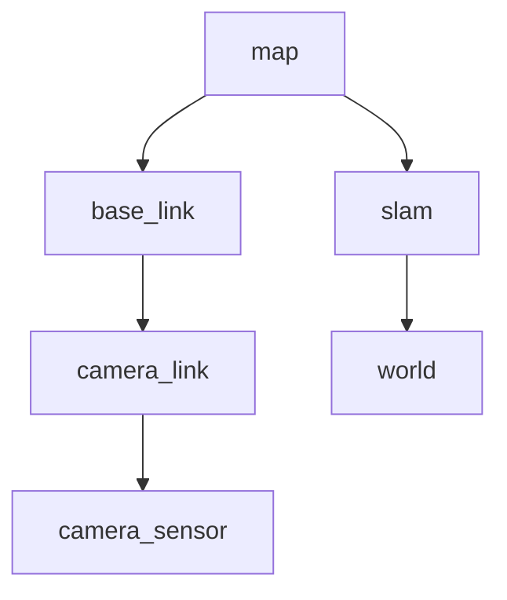

# Orca5 TF Frames

This document describes the TF tree for the `orca5` system. The TF tree is structured identically in both the simulation (`sim.launch.py`) and live hardware (`hw.launch.py`) configurations.

## TF Tree

The expected transform tree looks like this:

## Frame Details

| Frame | Parent | Publisher | Type | Description |
|---|---|---|---|---|
| `map` | - | - | - | The fixed world coordinate frame (ENU). Root of the TF tree. |
| `base_link` | `map` | `slam_bridge.py` | Dynamic | The ROV's pose, as estimated by the ArduSub EKF. |
| `camera_link` | `base_link` | `static_transform_publisher` | Static | The physical mount point of the camera on the ROV. Published via the launch file. |
| `camera_sensor` | `camera_link` | `slam_bridge.py` | Static | The optical frame of the camera (OpenCV FLU). |
| `slam` | `map` | `slam_bridge.py` | Dynamic | The SLAM map correction transform, used to align the SLAM map with the EKF map. |
| `world` | `slam` | `slam_bridge.py` | Static | The root frame used by `orb_slam3_ros`. Rotated by 180 degrees around the X-axis from the `slam` frame. |
